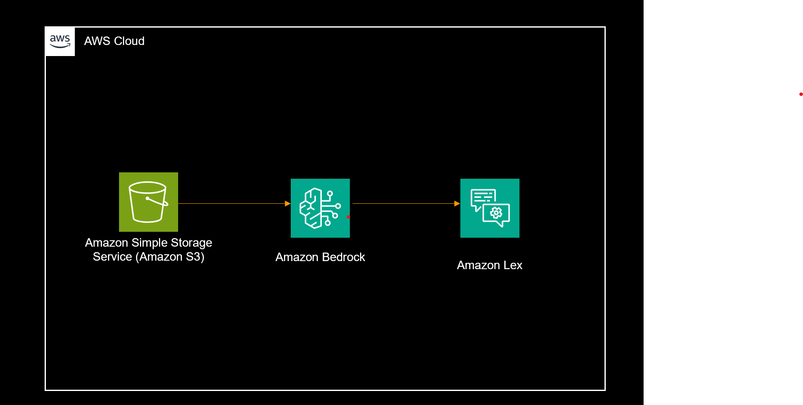

# AWS Internal Chatbot Using Lex

An AI-powered chatbot built using AWS-native services that combines Amazon Lex for conversational AI and Retrieval-Augmented Generation (RAG) using vector search to deliver accurate, context-aware responses.

The chatbot is embedded into a website and can answer questions based on custom knowledge stored in AWS.

## 🚀 Project Overview

This project demonstrates how to build a serverless AI chatbot without custom backend compute (no Lambda) by leveraging fully managed AWS services.



## 💡 What it does:
- Handles natural language conversations using Amazon Lex
- Retrieves relevant documents from a knowledge base using vector embeddings
- Uses LLMs via AWS Bedrock to generate intelligent responses
- Embedded directly into a website UI for real-time interaction

## 🧠 Key Features
- 🔍 **Retrieval-Augmented Generation (RAG)** - Semantic search with vector embeddings
- 💬 **Conversational interface** powered by Amazon Lex
- 📚 **Knowledge base** stored in Amazon S3
- ⚡ **Semantic search** using Amazon OpenSearch (vector embeddings)
- 🧠 **LLM response generation** using AWS Bedrock
- 🌐 **Website integration** using AWS chatbot UI
- ☁️ **Fully managed AWS architecture** (no backend servers)

## 🏗️ Architecture

```
User (Website Chat UI)
       ↓
Amazon Lex
       ↓
RAG Pipeline
       ↓
Amazon OpenSearch (Vector DB)
       ↓
Amazon S3 (Knowledge Base)
       ↓
AWS Bedrock (LLM)
       ↓
Amazon Lex
       ↓
User
```

## 🛠️ Tech Stack

### ☁️ AWS Services
- **Amazon Lex** - Conversational AI
- **AWS Bedrock** - LLM
- **Amazon S3** - Document Storage
- **Amazon OpenSearch Service** - Vector Search

### 🧠 AI Concepts
- Retrieval-Augmented Generation (RAG)
- Vector Embeddings
- Semantic Search

### 🌐 Frontend
- HTML / CSS / JavaScript
- AWS Chatbot Web UI Integration

## 🌐 Website Integration

The chatbot is embedded into a website using AWS's official chatbot UI approach:

https://aws.amazon.com/blogs/machine-learning/deploy-a-web-ui-for-your-chatbot/

### Key Highlights:
- Lightweight embeddable chat interface
- Direct integration with Amazon Lex
- No backend server required
- Easily customizable UI

## ⚙️ Setup & Deployment

### 📌 Prerequisites
- AWS Account
- Configured IAM roles with appropriate permissions
- Amazon Lex bot setup
- AWS Bedrock access enabled
- OpenSearch domain configured

### 🚀 Setup Steps

#### 1. Upload Knowledge Base
- Store documents in Amazon S3
- Prepare documents for embedding

#### 2. Configure OpenSearch
- Create vector index
- Generate embeddings for documents

#### 3. Set up Amazon Lex
- Define intents and utterances
- Integrate with Bedrock for response generation

#### 4. Connect RAG Flow
- Retrieve relevant documents from OpenSearch
- Pass context to Bedrock LLM

#### 5. Embed Chatbot UI
- Use AWS Web UI integration
- Add chatbot to your website
