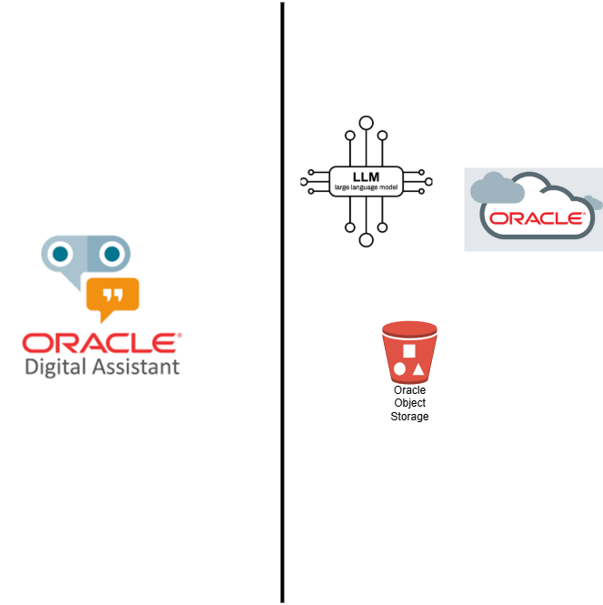

# Oracle Digital Assistant with LangGraph Integration  

## 📌 Overview  
This project demonstrates how to integrate **Oracle Digital Assistant (ODA)** with **LangGraph**, enabling a conversational agent that can:  

- Accept user queries through an **Oracle Digital Assistant chatbot**.  
- Process and orchestrate queries via **LangGraph Agent**.  
- Use specialized tools for:  
  - **Vector Search** over Oracle Object Storage documents.  
  - **LLM-powered response generation** (using OpenAI, Oracle GenAI, or other providers).  

This setup allows enterprises to create **knowledge-driven, context-aware chat interfaces** that can search internal documentation and generate intelligent, conversational responses.  

---

## 🏗️ Architecture  

User (Chat Interface)
│
▼
Oracle Digital Assistant (Chatbot)
│
▼
LangGraph Agent
├─ Tool 1: Vector Search over Oracle Object Storage Docs
└─ Tool 2: LLM Response Generation (e.g., OpenAI / Oracle GenAI)

---

## ⚙️ Features  

- 🔹 **Oracle Digital Assistant** for user-friendly chat interaction.  
- 🔹 **LangGraph Agent Orchestration** for decision-making and tool routing.  
- 🔹 **Vector Search** to query enterprise documents stored in Oracle Object Storage.  
- 🔹 **Generative AI Response Generation** for natural, context-aware answers.  
- 🔹 **Extensible design** to plug in additional tools (databases, APIs, SaaS integrations).  

---

## 🚀 Getting Started  

### Prerequisites  
- Oracle Cloud account with **Digital Assistant** and **Object Storage** enabled.  
- Access to an **LLM API key** (OpenAI, Oracle GenAI, or others).  
- Python 3.10+  
- [LangGraph](https://python.langchain.com/docs/langgraph) installed.  

### Environment Setup

Create a .env file with the following variables:

ORACLE_OBJECT_STORAGE_NAMESPACE=<your_namespace>
ORACLE_OBJECT_STORAGE_BUCKET=<your_bucket>
OPENAI_API_KEY=<your_api_key>  # or Oracle GenAI credentials
